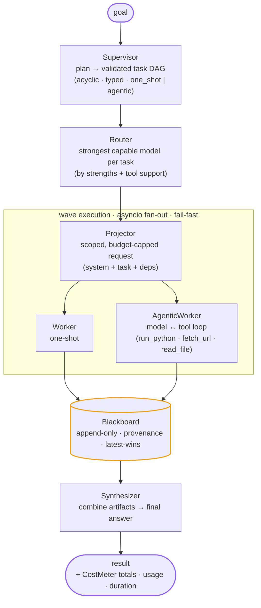

# Baton

[](https://github.com/ribato22/baton/actions/workflows/ci.yml)
[](https://github.com/ribato22/baton/blob/main/LICENSE)
[](pyproject.toml)
[](https://github.com/astral-sh/ruff)

**A cross-provider multi-model AI orchestration engine.** A *supervisor* model decomposes a goal
into a task DAG, *routes* each sub-task to the best-quality model capable of it — by required
strengths and tool support — across providers (Anthropic, any OpenAI-compatible endpoint, Ollama),
runs them one-shot or in an agentic tool loop, and *synthesizes* a final answer. Built without an
orchestration framework (no LangChain / CrewAI / LiteLLM).

> One conductor, many players — pass the *baton* from the leader model to the workers and back.

---

## Highlights

- **Supervisor + routing.** An LLM plans a validated, acyclic task DAG; a router sends each task
  to the strongest model capable of it (by required strengths + tool support). `--prefer
  cash_protect_quota` right-sizes instead, to protect subscription quota.
- **Cross-provider.** `AnthropicProvider` and a generic `OpenAICompatProvider` speak to Anthropic,
  Google AI Studio (Gemini), Groq, OpenRouter, DeepSeek, Moonshot (Kimi), local Ollama, and any
  other OpenAI-compatible endpoint — no code changes, just env vars.
- **Hybrid one-shot / agentic.** Tasks run as a single call *or* as a model↔tool loop (`run_python`
  in a subprocess sandbox — container-isolated under `BATON_SANDBOX=docker` — plus host-mediated
  `fetch_url` / `read_file`).
- **Shared context.** An append-only *blackboard* carries provenance; each task gets a scoped,
  budget-capped projection of only the dependency artifacts it needs.
- **Streaming everywhere.** Live token streaming through the supervisor, workers, and synthesizer,
  with per-task labels for parallel workers and cooperative early-stop.
- **Optional Web UI.** A small FastAPI + SSE app streams a run live in the browser (plan → per-task
  worker output → synthesis → result); runs with real providers or a no-key demo.
- **Cost & honesty.** A `CostMeter` tallies per-model usage and cost, and propagates an *estimated*
  flag when a provider returns no usage.
- **Forgery-resistant evaluation.** A 3-arm eval (baseline vs. orchestration vs. single-agent) with
  a scorer that runs untrusted solution code under **process + filesystem separation** so a model
  cannot fake a passing score.
- **Tested.** 560+ tests, zero-network by default (`FakeProvider` + local subprocesses), `ruff`-clean.

## Architecture



<details>
<summary>Text version (renders anywhere, e.g. PyPI or a terminal)</summary>

```text
                    ┌──────────────┐
   goal ──────────► │  Supervisor  │  plan → validated task DAG (acyclic, typed, one_shot|agentic)
                    └──────┬───────┘
                           ▼
                    ┌──────────────┐   per task: pick the strongest model whose strengths +
                    │    Router    │   tool support fit the task (quality-first)
                    └──────┬───────┘
                           ▼
        ┌───────────── wave execution (asyncio, fan-out cap, fail-fast) ─────────────┐
        │   ┌───────────┐   scoped, budget-capped request (system + task + deps)      │
        │   │ Projector │──────────────────────────────────────────────────────────► │
        │   └───────────┘                                                             │
        │        ▼                              ▼                                      │
        │   ┌─────────┐  one-shot          ┌───────────────┐  model↔tool loop         │
        │   │ Worker  │                    │ AgenticWorker │  (run_python sandbox,     │
        │   └────┬────┘                    └───────┬───────┘   fetch_url, read_file)   │
        │        └──────────────┬──────────────────┘                                   │
        └───────────────────────┼───────────────────────────────────────────────────┘
                                 ▼
                    ┌──────────────────────┐   append-only, provenance, latest-wins
                    │  Blackboard          │◄──────────────────────────────────────
                    └──────────┬───────────┘
                               ▼
                    ┌──────────────┐
                    │ Synthesizer  │  combine artifacts → final answer
                    └──────┬───────┘
                           ▼
                        result  (+ CostMeter totals, usage, duration)
```

</details>

| Component | File | Responsibility |
|---|---|---|
| Supervisor | `src/baton/supervisor.py` | Decompose goal → validated task DAG |
| Router | `src/baton/router.py` | Task → strongest capable model (by strengths + tool support) |
| Projector | `src/baton/projector.py` | Scoped, budget-capped request from blackboard artifacts |
| Worker | `src/baton/worker.py` | One-shot model call |
| AgenticWorker | `src/baton/agent.py` | Model↔tool loop with per-turn records |
| Blackboard | `src/baton/blackboard.py` | Append-only shared state with provenance |
| Synthesizer | `src/baton/synthesizer.py` | Artifacts → final answer |
| Runtime | `src/baton/runtime.py` | Orchestrate: plan → waves → synthesize (streaming, fail-fast) |
| Providers | `src/baton/providers/` | Anthropic + OpenAI-compatible adapters (complete/stream/tools) |
| Tools | `src/baton/tools/` | Sandbox / DockerSandbox, run_python, fetch_url, read_file |
| Eval | `eval/` | 5 composite goals, 3-arm comparison, forgery-resistant scorer |

## Quickstart

Requires **Python 3.11+** and [`uv`](https://docs.astral.sh/uv/).

```bash
git clone https://github.com/ribato22/baton
cd baton
uv sync --dev            # install deps + dev tools
uv run pytest            # 580+ tests, no network
uv run ruff check .      # lint

# See it orchestrate end-to-end with ZERO API keys (FakeProvider demo):
uv run python examples/fake_provider.py
```

Then configure at least one real provider (see [Providers](#providers)) and run a demo:

```bash
cp .env.example .env     # fill in one provider, then `set -a; . .env; set +a`

uv run python demo.py               # show detected providers
uv run python demo.py orchestrate   # full supervisor → workers → synth, streamed live
uv run python demo.py agentic       # one cross-provider agentic coding task (run_python loop)
uv run python demo.py eval          # 3-arm eval suite
```

### Example output

`demo.py orchestrate` streams every phase live, then prints the result (illustrative):

```text
Orchestrate demo — planner/synth model=openai/gpt-4o-mini

(planning + workers + synthesis stream live)
[haiku] Threads run as one— / tasks bloom in parallel time, / the join gathers all.

STATUS: success

FINAL:
Threads run as one—
tasks bloom in parallel time,
the join gathers all.

cost: $0.001834
```

`demo.py eval` prints the 3-arm table (`format_report`); read the `VERDICT` with the warnings
(illustrative numbers):

```text
GOAL          WINNER            BASE   ORCH   AGEN
-------------------------------------------------
slugify       orchestration     0.70   1.00   0.85
roman         baseline          1.00   0.85   0.55
calc          orchestration     0.55   0.85   0.70
csv_stats     agentic           0.40   0.55   0.85
json_flatten  orchestration     0.70   1.00   0.85
-------------------------------------------------
wins: baseline=1  orchestration=3  agentic=1  ties=0
totals: baseline $0.0210  orchestration $0.0480  agentic $0.0350
VERDICT: ORCHESTRATION
```

## Usage

Baton ships three surfaces: a one-command **CLI** (the primary entrypoint), an optional **Web UI**,
and an importable **library**. All three need at least one configured provider — see
[Providers](#providers) — or (Web UI only) fall back to a no-key demo.

### CLI (primary)

```bash
uv run baton "write a haiku about concurrency, then explain the metaphor"
```

`baton` streams the plan, each parallel worker's output (labelled per task), and the synthesis live,
then prints a summary. Flags (`baton --help`):

| Flag | Description |
|---|---|
| `--prefer {quality,cash_protect_quota,local,cheap}` | routing objective (default `quality` — the strongest model capable of each task). `cash_protect_quota` right-sizes to protect subscription quota; `local`/`cheap` are accepted but currently behave as `quality` |
| `--provider NAME` / `-P NAME` | restrict the planner/synth baseline to this provider |
| `--model ID` | override the planner/synth `model_id` |
| `--json` | print the run summary as one parseable JSON line; disables streaming |
| `--no-stream` | disable live streaming of plan/worker/synth text |
| `--version` | print the installed version and exit |

Exit codes: `0` success, `1` run failure, `2` config error (e.g. no provider configured), `130`
Ctrl-C (prints whatever partial output had streamed so far — never a raw traceback).

The text-mode summary reports `billed_usd` (real cash spent) vs. `credit_usd` (subscription/plan
API-equivalent valuation of subscription calls, not cash) plus `subscription_models` (the count of
distinct subscription-billed models used) — a subscription run is cash-free but still consumes your
interactive quota (see below).

### Web UI

```bash
uv sync --extra ui
uv run python -m webui          # then open http://127.0.0.1:8000
```

A small FastAPI + Server-Sent-Events app streams a run live in the browser — the plan, each parallel
worker's output (labelled per task), the synthesis, and the final result with cost. It runs with your
configured providers, or a built-in `FakeProvider` demo if none are set (no API key needed). This is
a **source-checkout feature** — `webui/` is not shipped in the built wheel/PyPI package.

`BATON_UI_HOST` / `BATON_UI_PORT` override the bind address. The page inserts all model output via
`textContent` only (never raw HTML), so streamed text cannot inject markup.

### Library

```python
import asyncio
import baton


async def main() -> None:
    registry, providers, model_id = baton.build_providers_from_env()
    runtime = baton.make_runtime_factory(registry, providers, model_id)()
    result = await runtime.aexecute("your goal")
    print(result.status, result.billed_usd, result.credit_usd)


asyncio.run(main())
```

The top-level `baton` package re-exports the common library API (`Runtime`, `Registry`,
`Router`, `build_providers_from_env`, `make_runtime_factory`, `RunResult`, `ModelInfo`, `Task`,
`LLMProvider`, `ProviderError` — see `baton.__all__`) so you don't need to reach into submodules
for everyday use.

See [`examples/`](examples/) for runnable scripts — including
[`examples/fake_provider.py`](examples/fake_provider.py), which needs **no API key** at all. For a
guided tour with hardcoded goals, see the demo script:
`uv run python demo.py orchestrate|agentic|eval` (walked through in [Quickstart](#quickstart)).

### Using your Claude / ChatGPT subscription (no API key)

Baton can drive the *official headless CLIs* you're already logged into instead of (or alongside) a
card-billed API key:

```bash
export CLAUDE_CODE_ENABLED=1               # needs `claude` installed and logged in
# CLAUDE_CODE_SYSTEM_PROMPT_MODE=replace is the default — makes `claude -p` behave as a
# raw completion; `append` breaks strict-JSON planning, so leave it unset unless you know why.
export CODEX_ENABLED=1 CODEX_TIER=3         # needs `codex login`
uv run baton "your goal"
```

> ⚠️ **Subscription runs are cash-free but consume your interactive Claude Code / Codex quota** —
> the same pool your interactive coding sessions draw from. A heavy orchestration run can trip a
> rate-limit pause. The default `quality` objective favors the strongest capable model per task,
> which can lean on subscription models. Pass `--prefer cash_protect_quota` to mitigate this — it
> sends bulk/easy work to cheaper local/free-tier models and reserves subscription models for hard
> tasks only.
> A card-billed, free-tier, or local model as **planner** is recommended: subscription CLIs ignore
> `temperature`, so Baton retries planning with self-correction and can gate `claude -p` as planner
> behind a live parse-plan check (it only plans if it demonstrably emits valid plan JSON).
>
> This drives the **official headless CLIs** (`claude -p`, `codex exec`) that you are already logged
> into — never the claude.ai / ChatGPT web apps. Scraping those web apps is not implemented (it would
> violate their Terms of Service).

### In your IDE (VSCode) & MCP

Baton is a CLI first, so it already works in **any** editor's integrated terminal (`uv run baton
"…"`). For VSCode there are two extra conveniences:

**1. One-keystroke tasks.** The repo ships [`.vscode/tasks.json`](.vscode/tasks.json). Open
*Terminal → Run Task…* (or press `⌘/Ctrl+Shift+B`) and pick:

| Task | What it does |
|------|--------------|
| **Baton: Run goal** | Prompts for a goal and orchestrates it (streams plan → workers → synthesis). |
| **Baton: Web UI** | Serves the live Web UI at <http://127.0.0.1:8000>. |
| **Baton: MCP server (stdio)** | Runs the MCP server for AI-agent integration (below). |
| **Baton: Test / Lint** | `pytest` / `ruff` over the project. |

**2. MCP server — let the AI *inside* your editor call Baton.** Baton ships an
[MCP](https://modelcontextprotocol.io) server ([`baton_mcp/`](baton_mcp/)) exposing one tool,
`baton_run(goal, prefer?)`, that plans → routes → runs → synthesizes and returns the final answer
plus an honest cash/plan-credit footer. Any MCP-capable assistant (Claude Code, Cursor, VS Code
Copilot *agent mode*, Windsurf) can then delegate whole goals to Baton.

Install it clone-free (recommended), or from a source checkout:

```bash
# clone-free — uv fetches the published package + the `mcp` extra on demand:
uvx --from "baton-orchestrator[mcp]" baton-mcp

# or install it and run the console script:
pip install "baton-orchestrator[mcp]"   # then:
baton-mcp

# or from a source checkout:
uv sync --extra mcp && uv run --extra mcp python -m baton_mcp
```

Register it with your client. **Claude Code** — one command:

```bash
claude mcp add baton -- uvx --from "baton-orchestrator[mcp]" baton-mcp
```

**Cursor / VS Code / Windsurf** — add to the client's MCP config (e.g. `.cursor/mcp.json`, or
VS Code's `.vscode/mcp.json` under a `"servers"` key):

```jsonc
{
  "mcpServers": {
    "baton": {
      "command": "uvx",
      "args": ["--from", "baton-orchestrator[mcp]", "baton-mcp"]
    }
  }
}
```

The server reads providers from the environment exactly like the CLI (including
`CLAUDE_CODE_ENABLED` / `CODEX_ENABLED`), so configure at least one provider first — it does **not**
fall back to a demo. A full branded VSCode *extension* is intentionally **not** shipped; the CLI,
tasks, and the MCP server cover the same ground.

**In the official MCP registry.** Baton is published to the
[official MCP registry](https://registry.modelcontextprotocol.io) as `io.github.ribato22/baton`
(a validated [`server.json`](server.json) manifest plus a `publish-mcp.yml` GitHub Actions workflow
that re-publishes it via OIDC on each release). Directories such as [mcp.so](https://mcp.so),
[PulseMCP](https://www.pulsemcp.com), and [Glama](https://glama.ai) index from it.

**As a Claude Code plugin.** This repo also doubles as a plugin marketplace — one command wires the
MCP server and a `/baton:run` slash command into Claude Code:

```text
/plugin marketplace add ribato22/baton
/plugin install baton@baton
```

Requires [`uv`](https://docs.astral.sh/uv/) on your PATH (the plugin launches the server with
`uvx`). See [`plugins/baton/`](plugins/baton/).

## Providers

Set environment variables for any subset; baseline priority is
**Anthropic > OpenAI-compat > Kimi > Ollama**. See [`.env.example`](https://github.com/ribato22/baton/blob/main/.env.example) for the full list.

| Provider | Env | Access |
|---|---|---|
| **Anthropic** (Claude) | `ANTHROPIC_API_KEY` | Paid API (`console.anthropic.com`) |
| **Generic OpenAI-compatible** | `OPENAI_COMPAT_BASE_URL`, `OPENAI_COMPAT_MODEL` (+`_KEY`/`_NAME`/`_CONTEXT`/…) | Any OpenAI-compatible endpoint |
| **Moonshot / Kimi** | `MOONSHOT_API_KEY` | Paid API |
| **Ollama** | `OLLAMA_BASE_URL` | **Local & free** |

> **Subscription CLI agents are opt-in and consume your interactive quota.** Scraping claude.ai /
> ChatGPT is not built (ToS, fragile, ban risk). Instead Baton can drive the *official headless CLIs*
> you're already logged into — Claude Code (`claude -p`) and Codex (`codex exec`) — with no API key.
> This is **off by default** (`CLAUDE_CODE_ENABLED=1` / `CODEX_ENABLED=1` plus the CLI installed) and
> is **never** used by the eval. Honest caveat: `claude -p` and `codex exec` today draw from the
> **same interactive subscription pool** as the chat apps (not a separate/metered bucket), so a full
> orchestration run — and especially the 3-arm eval — can burn your Claude Code / Codex allowance and
> trip a mid-run hard-pause. Baton reports `credit_usd` (subscription value consumed) separately from
> `billed_usd` (cash), routes only hard/high-tier tasks to subscription (bulk work goes to
> local/free-tier), and caps subscription calls per run (`BATON_MAX_SUBSCRIPTION_CALLS`, default 4).
>
> **Billing surface moves — re-verify before trusting it.** Whether `claude -p` bills against the
> subscription pool vs. a metered API-rate credit bucket has flipped several times in months
> (announced 2026-06-15, then paused; still paused as of 2026-07-22). When Anthropic next announces a
> billing change, repeat the live gate in
> [`docs/claude-code-live-gate.md`](https://github.com/ribato22/baton/blob/main/docs/claude-code-live-gate.md)
> and re-check the Help Center banner, then update the "verified" date recorded there.

**Free, high-intelligence option** — Google AI Studio (Gemini Flash), via the generic slot:

```bash
export OPENAI_COMPAT_BASE_URL=https://generativelanguage.googleapis.com/v1beta/openai/
export OPENAI_COMPAT_KEY=<ai-studio-key>       # aistudio.google.com/apikey
export OPENAI_COMPAT_MODEL=gemini-flash-latest # pick a current model from the endpoint's /models
export OPENAI_COMPAT_NAME=google/gemini-flash
uv run python demo.py orchestrate
```

The generic slot defaults to industry-standard values (context 128k, output 8k, tool-capable, cost
0 for free tiers) and registers its own `ModelInfo`, so cost/context accounting is correct.

**Several providers at once** — add `OPENAI_COMPAT_2_*`, `OPENAI_COMPAT_3_*`, … (each with its own
`model_id` / pricing / context). For example Gemini plus Groq, so the supervisor plans on Gemini
while the cheaper Groq model runs the parallel workers — genuine cross-provider orchestration. See
[`.env.example`](https://github.com/ribato22/baton/blob/main/.env.example).

## Evaluation

`demo.py eval` runs a **3-arm** comparison over 5 composite coding goals: **baseline** (one strong
model, one shot), **orchestration** (the full engine), and **agentic-single** (one model + a
`run_python` loop, no decomposition). Each goal is scored by a hidden reference test.

The scorer runs the model's generated `solution.py` in a subprocess under **process + filesystem
separation**: a trusted runner drives the untrusted solution in a *separate* process that never sees
the expected outputs (nonce-authenticated RPC), so a solution must actually compute correct answers —
it cannot fake a passing score.

Read the verdict together with the warnings the harness emits:

- `WARNING: some costs are estimated …` — a provider returned no usage; cost comparison is soft.
- `WARNING: agentic arm failed N run(s) …` — a `0.0` may be infra/provider failure, not capability.
- `WARNING: goal(s) […] produced NO trusted result …` — the reference runner itself is broken; those
  scores are harness artifacts, not real zeros.

## Security & limitations (honest)

This is a study project; its isolation guarantees are deliberately scoped and documented.

- **Agentic sandbox is for self-written goals.** The default subprocess `Sandbox` protects against
  *accidents*, not *adversaries*: on macOS the host network and disk remain reachable. For real
  isolation use `BATON_SANDBOX=docker` (runs code in a container with `--network none`, read-only
  root, cgroup limits) — this is the prerequisite for the network-isolation guarantee.
- **External tools are host-mediated.** `fetch_url` (domain allowlist) and `read_file` (root-confined)
  run in the trusted orchestrator so sandboxed code stays network-isolated. Prompt-injection
  containment holds only under the Docker sandbox.
- **Eval scoring is forgery-resistant, best-effort POSIX.** Process + filesystem separation stops a
  solution from faking a score; a solution calling `setsid()` can still escape the `killpg` group
  (the wall-clock timeout still bounds the run). It is process isolation, not a security sandbox for
  arbitrary hostile code.
- **Never put secrets in model context.** Allowlists and the read-file root are the trust boundary.

## Project layout

```text
src/baton/     # engine (importable package: `baton`)
  providers/          # Anthropic + OpenAI-compatible adapters, FakeProvider
  tools/              # Sandbox, DockerSandbox, run_python, fetch_url, read_file
eval/                 # goals, 3-arm harness, forgery-resistant scorer, runner
examples/             # small runnable library-API scripts (incl. a no-key FakeProvider demo)
webui/                # optional FastAPI + SSE web UI (uv run python -m webui)
tests/                # 560+ tests (unit + opt-in integration)
docs/                 # internal design/build records — see docs/README.md; not user docs
demo.py               # end-to-end demo (orchestrate | agentic | eval)
```

## Development

- **Test-driven, zero-network by default.** `uv run pytest` uses `FakeProvider` and local
  subprocesses; integration tests that touch the network/Docker are marked `integration` and skipped
  by default (`uv run pytest -m integration` to opt in).
- **Lint:** `uv run ruff check .` (line length 100; `E,F,I,UP,B`).
- Contributions welcome — see [CONTRIBUTING.md](https://github.com/ribato22/baton/blob/main/CONTRIBUTING.md)
  and our [Code of Conduct](https://github.com/ribato22/baton/blob/main/CODE_OF_CONDUCT.md).
  Security reports: [SECURITY.md](https://github.com/ribato22/baton/blob/main/SECURITY.md). Release notes:
  [CHANGELOG.md](https://github.com/ribato22/baton/blob/main/CHANGELOG.md).

## Non-goals

Baton is a **study engine** for multi-model orchestration, not a production framework.
It deliberately avoids LangChain, LiteLLM, and CrewAI — the point is to see how a supervisor, router,
projector, and blackboard actually work under the hood, not to hide them behind an abstraction. Don't
adopt it as a drop-in production agent framework; treat it as a reference implementation to read,
fork, and learn from.

## Roadmap

- Run the real 3-arm eval across providers and interpret whether orchestration beats a single model.
- Per-task labelled streaming to a UI; async-generator / backpressure streaming API.
- Ollama tool-calling / streaming integration coverage.

## License

[MIT](https://github.com/ribato22/baton/blob/main/LICENSE) © 2026 ribato.

<!-- MCP registry ownership marker (proves this PyPI package maps to the server name). -->
<!-- mcp-name: io.github.ribato22/baton -->
